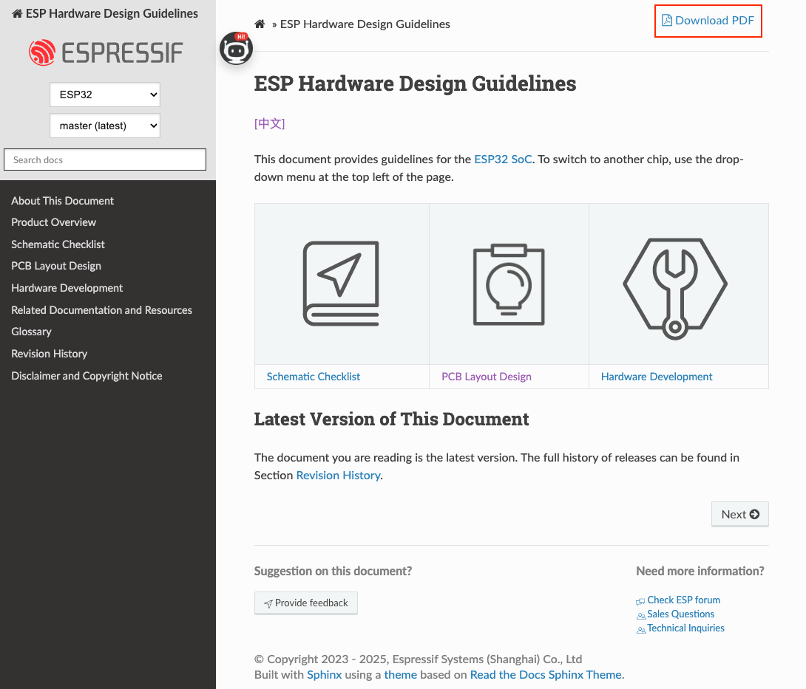
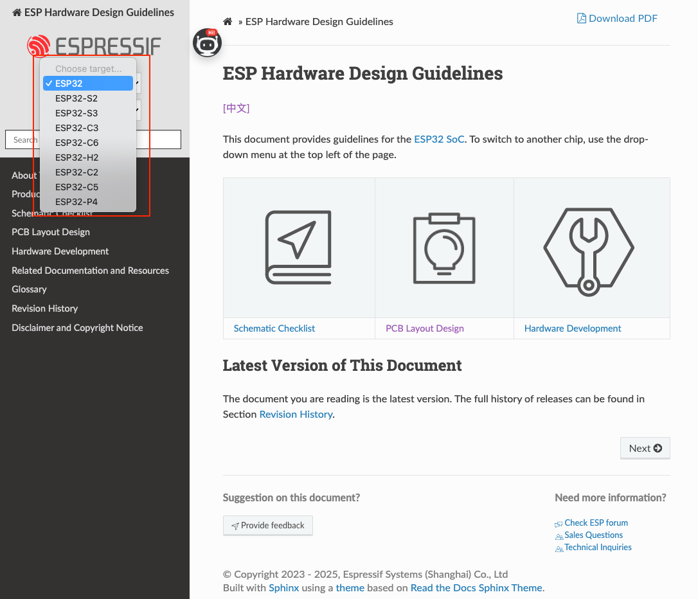
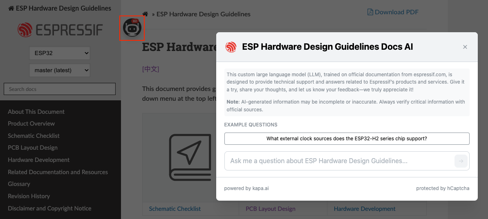

# ESP Hardware Design Guidelines ([中文](README_CN.md))

Welcome to the **ESP Hardware Design Guidelines** repository. This repository hosts the hardware design guidelines for Espressif's system-on-chip (SoC) products. Whether you're working on schematic design, PCB layout, or RF performance optimization, these guidelines are here to help improve your product's performance, reliability, and development efficiency. Below are the guidelines for each chip series:

- [ESP32 Hardware Design Guidelines](https://docs.espressif.com/projects/esp-hardware-design-guidelines/en/latest/esp32/index.html)
- [ESP32-S2 Hardware Design Guidelines](https://docs.espressif.com/projects/esp-hardware-design-guidelines/en/latest/esp32s2/index.html)
- [ESP32-S3 Hardware Design Guidelines](https://docs.espressif.com/projects/esp-hardware-design-guidelines/en/latest/esp32s3/index.html)
- [ESP32-C3 Hardware Design Guidelines](https://docs.espressif.com/projects/esp-hardware-design-guidelines/en/latest/esp32c3/index.html)
- [ESP32-C6 Hardware Design Guidelines](https://docs.espressif.com/projects/esp-hardware-design-guidelines/en/latest/esp32c6/index.html)
- [ESP32-H2 Hardware Design Guidelines](https://docs.espressif.com/projects/esp-hardware-design-guidelines/en/latest/esp32h2/index.html)
- [ESP32-C2 (ESP8684) Hardware Design Guidelines](https://docs.espressif.com/projects/esp-hardware-design-guidelines/en/latest/esp32c2/index.html)
- [ESP32-C5 Hardware Design Guidelines](https://docs.espressif.com/projects/esp-hardware-design-guidelines/en/latest/esp32c5/index.html)
- [ESP32-P4 Hardware Design Guidelines](https://docs.espressif.com/projects/esp-hardware-design-guidelines/en/latest/esp32p4/index.html)

## Features

The key features of this repository are:

- Multi-format output
    - The Hardware Design Guidelines are available in both **PDF** and **HTML** formats.
    - To get the PDF version, click the "Download PDF" button in the top-right corner of the HTML page.

      

- Select by Chip Series
    - Use the chip selection drop-down menu in the top-left corner of the page to select a chip series and view the corresponding Hardware Design Guidelines.

      

- Chatbot Assistance (New!)
    - **Need quick answers? Our AI-powered chatbot is here to help!**
    - You can ask questions in **any language**.
    - The bot responds based **exclusively on Espressif’s official documentation**.
    - If the requested information is not covered, the chatbot will clearly state that—avoiding inaccurate or speculative answers.
    - **Each response includes references**, so you can easily verify the information.

       

## Open Source Licensing

This repository is distributed under multiple open source licenses, depending on the type of content:

- **Code**: All code files (unless otherwise specified) are licensed under the [Apache License 2.0](./LICENSE-APACHE). This allows commercial use, modification, and redistribution, provided that the original copyright notice and a description of any changes are retained.
- **Documentation**: All documentation content in this repository (including text, diagrams, and images) is licensed under the [Creative Commons Attribution-ShareAlike 4.0 International (CC BY-SA 4.0)](./LICENSE-CC-BY-SA).

Under the CC BY-SA 4.0 license, you are free to reuse, adapt, and share the documentation, as long as you meet the following conditions:

- Attribute the original source (e.g., link to this repository or specific documentation pages)
- Provide a link to the license
- Indicate whether any changes were made
- Distribute derivative works under the same license

## Feedback and Contributing

Espressif Documentation and Hardware teams encourage contributions from the community to enhance and refine the Hardware Design Guidelines.

If you have insights, updates, or suggestions to share, feel free to

- Leave a comment using the "Provide Feedback" button at the bottom of any [HTML documentation page](https://docs.espressif.com/projects/esp-hardware-design-guidelines/en/latest/esp32/index.html)
- Report an issue via [GitHub Issues](https://github.com/espressif/esp-hardware-design-guidelines/issues)
- Submit a fix via [Pull Request (PR)](https://github.com/espressif/esp-hardware-design-guidelines/pulls)
    > For PRs, follow the [Contributing Guide](./CONTRIBUTING.md).

## Translations

This documentation is currently available in:

- English
- [Chinese（中文）](README_CN.md)

Interested in contributing a translation in another language? You're welcome to submit a [Pull Request (PR)](https://github.com/espressif/esp-hardware-design-guidelines/pulls).

Let us know if you find this project useful—we appreciate your feedback and contributions!
