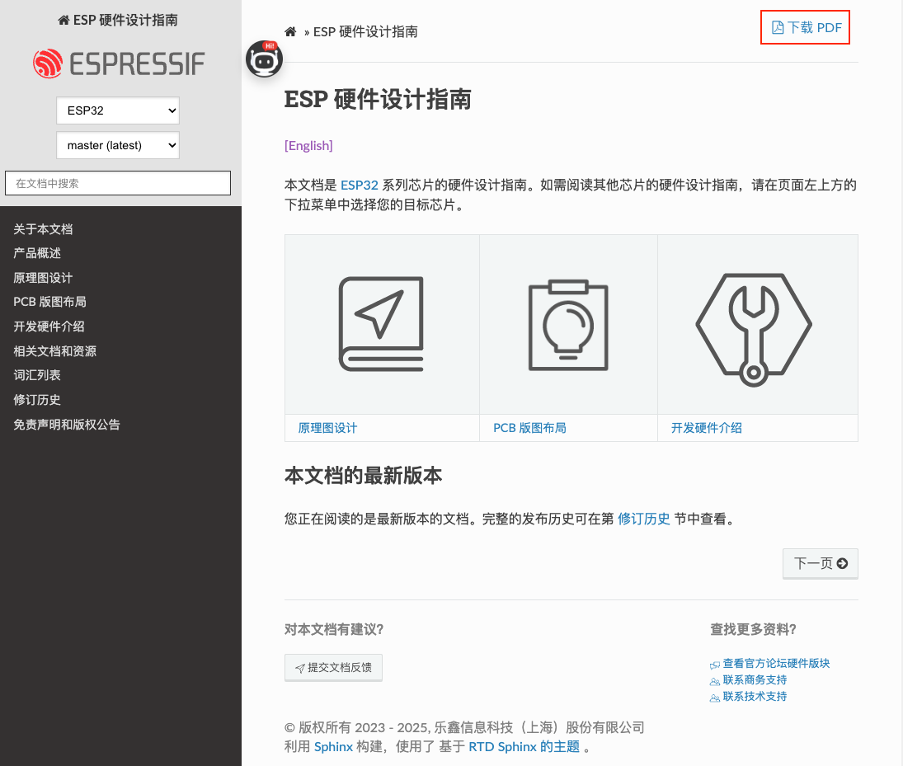
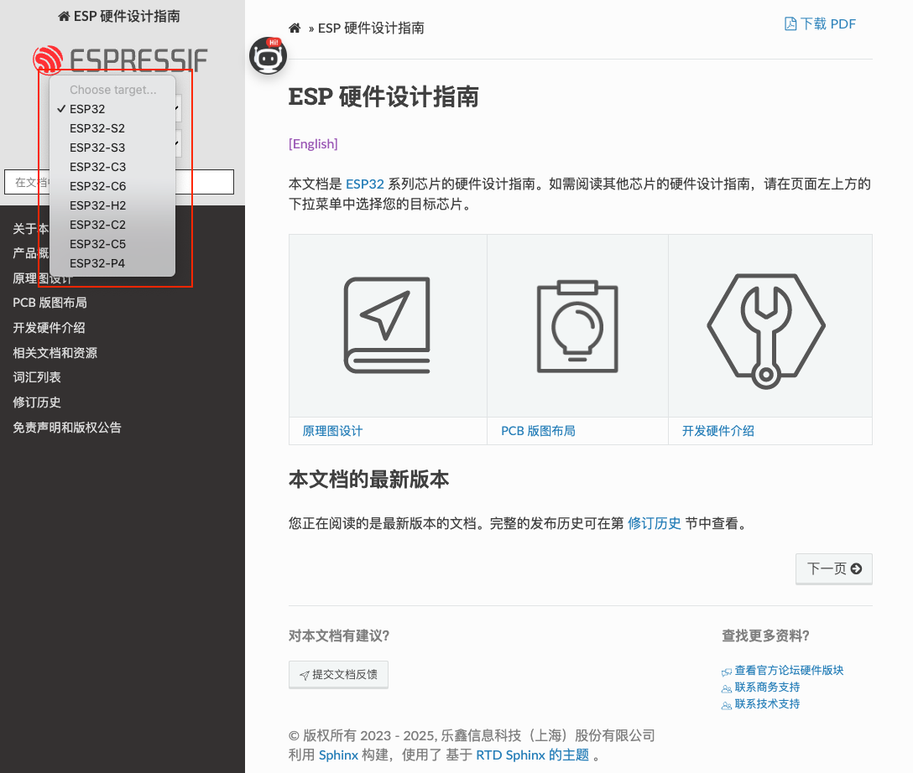
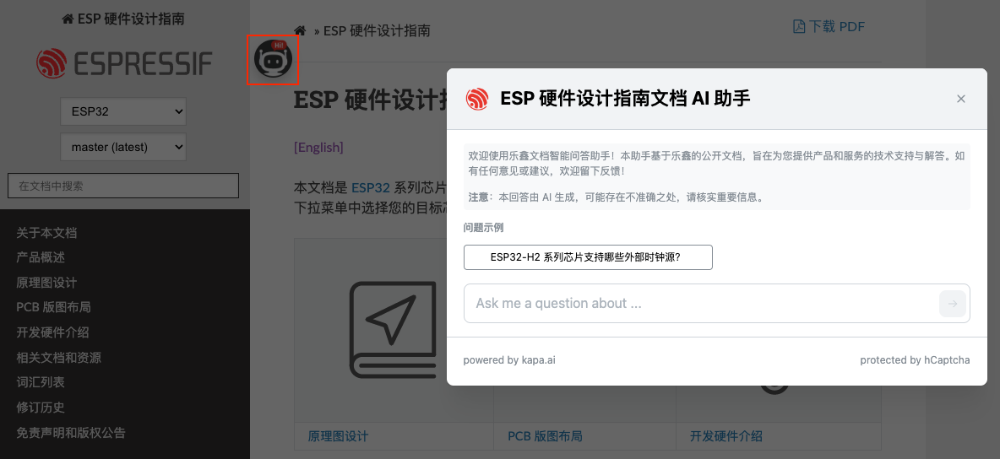

# ESP 硬件设计指南 ([English](README.md))

欢迎访问 **ESP 硬件设计指南** 仓库。本仓库维护并发布乐鑫系统级芯片 (SoC) 的硬件设计指南。无论是原理图设计、PCB 版图布局，还是射频性能优化，本指南均可为您提供参考，助力提升产品性能、可靠性及设计效率。以下是各芯片系列的设计指南：

- [ESP32 硬件设计指南](https://docs.espressif.com/projects/esp-hardware-design-guidelines/zh_CN/latest/esp32/index.html)
- [ESP32-S2 硬件设计指南](https://docs.espressif.com/projects/esp-hardware-design-guidelines/zh_CN/latest/esp32s2/index.html)
- [ESP32-S3 硬件设计指南](https://docs.espressif.com/projects/esp-hardware-design-guidelines/zh_CN/latest/esp32s3/index.html)
- [ESP32-C3 硬件设计指南](https://docs.espressif.com/projects/esp-hardware-design-guidelines/zh_CN/latest/esp32c3/index.html)
- [ESP32-C6 硬件设计指南](https://docs.espressif.com/projects/esp-hardware-design-guidelines/zh_CN/latest/esp32c6/index.html)
- [ESP32-H2 硬件设计指南](https://docs.espressif.com/projects/esp-hardware-design-guidelines/zh_CN/latest/esp32h2/index.html)
- [ESP32-C2 (ESP8684) 硬件设计指南](https://docs.espressif.com/projects/esp-hardware-design-guidelines/zh_CN/latest/esp32c2/index.html)
- [ESP32-C5 硬件设计指南](https://docs.espressif.com/projects/esp-hardware-design-guidelines/zh_CN/latest/esp32c5/index.html)
- [ESP32-P4 硬件设计指南](https://docs.espressif.com/projects/esp-hardware-design-guidelines/zh_CN/latest/esp32p4/index.html)

## 功能特性

本仓库的主要功能如下：

- 多格式输出
    - 硬件设计指南提供 **PDF** 和 **HTML** 两种格式。
    - 如需 PDF 格式，请点击 HTML 页面右上角的 “下载 PDF” 图标。

       

- 按芯片系列查看
    - 可通过页面左上角的芯片选择下拉菜单选择芯片系列，查看对应的硬件设计指南。

      

- 智能文档 AI 助手（新增！）
    - **需要快速解答？我们的 AI 文档助手随时为您提供帮助。**
    - 支持使用**任何语言**提问。
    - 回答内容**严格基于乐鑫官方文档**。
    - 如请求信息不在文档中，助手将明确说明，避免提供不准确或推测性的答案。
    - **每条回答均附有来源链接**，便于您进一步查阅与验证。

      

## 开源许可说明

本仓库采用多种开源许可协议，具体适用于不同类型的内容：

- **代码部分**：所有代码文件（除非另有说明）均采用 [Apache License 2.0](./LICENSE-APACHE) 许可协议，允许用于商业用途、修改和再发布，同时需保留原始版权声明并提供修改说明。
- **文档部分**：所有文档内容（包括文本、图表和图片）均采用 [知识共享署名-相同方式共享 4.0 国际许可协议 (CC BY-SA 4.0)](./LICENSE-CC-BY-SA) 授权。

根据 CC BY-SA 4.0 协议，您可以自由复制、修改和共享文档内容，但需遵守以下条件：

- 署名原始来源（例如链接至本仓库或具体页面）
- 提供该许可协议的链接
- 标明是否对内容进行了修改
- 以相同协议方式分发衍生内容

## 问题反馈与贡献指引

欢迎提出反馈建议或参与贡献，共同完善硬件设计指南。

您可以通过以下方式参与：

- 点击任意 [HTML 文档页面](https://docs.espressif.com/projects/esp-hardware-design-guidelines/zh_CN/latest/esp32/index.html) 底部的 “提交文档反馈” 图标留言
- 通过 [GitHub Issues](https://github.com/espressif/esp-hardware-design-guidelines/issues) 报告问题
- 提交 [Pull Request (PR)](https://github.com/espressif/esp-hardware-design-guidelines/pulls) 进行修复
    > 提交 PR 时，请遵循 [贡献指南](./CONTRIBUTING_CN.md)。

## 翻译版本

本文档目前提供以下语言版本：

- [英文 (English)](README.md)
- 中文

欢迎您贡献其他语言的翻译！如有兴趣，请提交 [Pull Request (PR)](https://github.com/espressif/esp-hardware-design-guidelines/pulls)。

如果您觉得本项目对您有帮助，欢迎与我们分享反馈，我们非常感谢您的支持和贡献！
