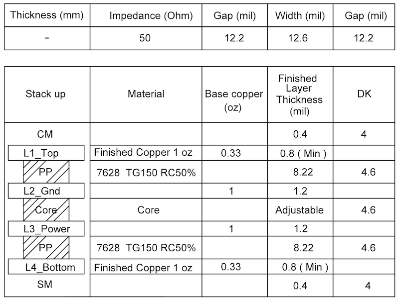

.. _pcb-layout-design:

PCB Layout Design
========================
:link_to_translation:`zh_CN:[中文]`

This chapter introduces the key points of how to design an {IDF_TARGET_NAME} PCB layout using an {IDF_TARGET_NAME} module (see Figure :ref:`fig-pcb-layout-example`) as an example.

.. figure:: ../_static/{IDF_TARGET_PATH_NAME}/{IDF_TARGET_PATH_NAME}-pcb-layout-example.png
   :name: fig-pcb-layout-example
   :align: center
   :width: 50%
   :alt: {IDF_TARGET_NAME} Reference PCB Layout

   {IDF_TARGET_NAME} Reference PCB Layout

General Principles of PCB Layout for the Chip
----------------------------------------------

It is recommended to use a four-layer PCB design:

- Layer 1 (TOP): Signal traces and components.
- Layer 2 (GND): No signal traces here to ensure a complete GND plane.
- Layer 3 (POWER): GND plane should be applied to better isolate the RF and crystal. Route power traces and a few signal traces on this layer, provided that there is a complete GND plane under the RF and crystal.
- Layer 4 (BOTTOM): Route a few signal traces here. It is not recommended to place any components on this layer.

.. only:: not esp32c5

    A two-layer PCB design can also be used:

    - Layer 1 (TOP): Signal traces and components.
    - Layer 2 (BOTTOM): Do not place any components on this layer and keep traces to a minimum. Please make sure there is a complete GND plane for the chip, RF, and crystal.

.. _pcb-layout-design-power-supply:

Power Supply
-----------------

{IDF_TARGET_POWER_TRACE_WIDTH:default="25", esp32c3="20", esp32c2="20", esp32h2="20", esp32c5="35"}

{IDF_TARGET_ANALOG_POWER_TRACE:default="VDD3P3", esp32c6="VDDA3P3", esp32c2="VDDA3P3", esp32h2="VDD3P3 at pin1 and pin2", esp32s2="VDD3P3 at pin3 and pin4", esp32c5="VDDA6, VDDA7, VDDA1, and VDDA2 at pin1, pin3, pin40, and pin41", esp32s3="VDD3P3 at pin2 and pin3"}

{IDF_TARGET_ANALOG_POWER_TRACE_WIDTH:default="20", esp32c3="15", esp32c2="15", esp32h2="15"}

{IDF_TARGET_ANALOG_FILTER_CIRCUIT:default="CLC", esp32c3="LC", esp32c2="LC"}

{IDF_TARGET_RF_POWER_TRACE:default="pin2 and pin3", esp32c5="pin1, pin3, pin40, and pin41"}

.. only:: not esp32h2

    .. include:: shared/pcb-power-layout-four-layer.inc

.. only:: esp32h2

    .. include:: {IDF_TARGET_PATH_NAME}/{IDF_TARGET_PATH_NAME}-pcb-power-layout-four-layer.inc

.. only:: esp32 or esp32c3 or esp32s2 or esp32s3 or esp32c6 or esp32c61

    .. include:: shared/pcb-power-layout-two-layer.inc

.. _crystal-layout:

Crystal
----------

{IDF_TARGET_CRYSTAL_GAP:default="to be defined", esp32="2.7", esp32s2="2.0", esp32s3="2.0", esp32c3="2.0", esp32c6="2.4", esp32h2="1.8", esp32c2="2.0", esp32s2="2.0", esp32c5="2.4", esp32c61="2.4"}

.. only:: esp32

    Figure :ref:`fig-crystal-ref-design` shows a reference layout for crystal on {IDF_TARGET_NAME}.

    .. figure:: ../_static/{IDF_TARGET_PATH_NAME}/{IDF_TARGET_PATH_NAME}-crystal-ref-design.png
        :name: fig-crystal-ref-design
        :align: center
        :width: 70%
        :alt: {IDF_TARGET_NAME} Crystal Layout

        {IDF_TARGET_NAME} Crystal Layout

.. only:: not esp32c2 and not esp32s2 and not esp32c3 and not esp32

    Figure :ref:`fig-crystal-not-to-gnd` shows a reference PCB layout where the crystal is connected to the ground through vias and a keep-out area is maintained around the crystal on the top layer for ground isolation.

    .. figure:: ../_static/{IDF_TARGET_PATH_NAME}/{IDF_TARGET_PATH_NAME}-pcb-crystal-not-to-gnd.png
        :name: fig-crystal-not-to-gnd
        :align: center
        :width: 70%
        :alt: {IDF_TARGET_NAME} Crystal Layout (with Keep-out Area on Top Layer)

        {IDF_TARGET_NAME} Crystal Layout (with Keep-out Area on Top Layer)

.. only:: esp32s3 or esp32h2 or esp32c2 or esp32s2 or esp32c3

    Figure :ref:`fig-crystal-to-gnd` shows the layout for the crystal that is connected to the ground through vias but there is no keep-out area on the top layer for ground isolation.

    .. figure:: ../_static/{IDF_TARGET_PATH_NAME}/{IDF_TARGET_PATH_NAME}-pcb-crystal-to-gnd.png
        :name: fig-crystal-to-gnd
        :align: center
        :width: 60%
        :alt: {IDF_TARGET_NAME} Crystal Layout (without Keep-out Area on Top Layer)

        {IDF_TARGET_NAME} Crystal Layout (without Keep-out Area on Top Layer)

.. only:: esp32s3 or esp32h2 or esp32c5 or esp32c61 or esp32c6

    If there is sufficient ground on the top layer, it is recommended to maintain a keep-out area around the crystal for ground isolation. This helps to reduce the value of parasitic capacitance and suppress temperature conduction, which can otherwise affect the frequency offset. If there is no sufficient ground, do not maintain any keep-out area.

The layout of the crystal should follow the guidelines below:

- Ensure a complete GND plane for the RF, crystal, and chip.
- The crystal should be placed far from the clock pin to avoid interference on the chip. The gap should be at least {IDF_TARGET_CRYSTAL_GAP} mm. It is good practice to add high-density ground vias stitching around the clock trace for better isolation.
- There should be no vias for the clock input and output traces.
- Components in series to the crystal trace should be placed close to the chip side.
- The external matching capacitors should be placed on the two sides of the crystal, preferably at the end of the clock trace, but not connected directly to the series components. This is to make sure the ground pad of the capacitor is close to that of the crystal.
- Do not route high-frequency digital signal traces under the crystal. It is best not to route any signal trace under the crystal. The vias on the power traces on both sides of the crystal clock trace should be placed as far away from the clock trace as possible, and the two sides of the clock trace should be surrounded by ground copper.
- As the crystal is a sensitive component, do not place any magnetic components nearby that may cause interference, for example large inductance component, and ensure that there is a clean large-area ground plane around the crystal.

.. _rf-layout:

RF
-----

{IDF_TARGET_STUB_LENGTH:default="15", esp32c5="10"}
{IDF_TARGET_RF_MATCHING_CIRCUIT:default="CLC", esp32c61="CLCCL", esp32c5="5G interface CLC", esp32c6="CLCCL"}

.. only:: esp32

    RF Layout on Four-layer PCB
    ^^^^^^^^^^^^^^^^^^^^^^^^^^^^

The RF trace is routed as shown highlighted in pink in Figure :ref:`fig-rf-layout`.

.. figure:: ../_static/{IDF_TARGET_PATH_NAME}/{IDF_TARGET_PATH_NAME}-pcb-rf-layout.png
    :name: fig-rf-layout
    :align: center
    :width: 50%
    :alt: {IDF_TARGET_NAME} RF Layout in a Four-layer PCB Design

    {IDF_TARGET_NAME} RF Layout in a Four-layer PCB Design

The RF layout should meet the following guidelines:

.. list::

    - The RF trace should have a 50 Ω characteristic impedance. The reference plane is the layer next to the chip. For designing the RF trace at 50 Ω impedance, you could refer to the PCB stack-up design shown below.

    {IDF_TARGET_NAME} PCB Stack-up Design

.. list::

    :esp32c2 or esp32c6 or esp32c61: - A {IDF_TARGET_RF_MATCHING_CIRCUIT} matching circuit should be added to the RF trace. Please use 0201 components and place them close to the pin in a zigzag. In other words, the two capacitors should not be oriented in the same direction to minimize interference.
    :esp32c5: - At least a CLC matching circuit is required for chip tuning. Please use 0201 components and place them close to the pin in a zigzag. In other words, the two capacitors should not be oriented in the same direction to minimize interference.
    :not esp32c2 and not esp32c5 and not esp32c6 and not esp32c61: - A CLC matching circuit is required for chip tuning. Please use 0201 components and place them close to the pin in a zigzag. In other words, the two capacitors should not be oriented in the same direction to minimize interference.
    :not esp32s2: - Add a stub on the grounding capacitor near the chip side in the {IDF_TARGET_RF_MATCHING_CIRCUIT} matching circuit to suppress the second harmonics. It is preferable to keep the stub length {IDF_TARGET_STUB_LENGTH} mil, and determine the stub width according to the PCB stack-up so that the characteristic impedance of the stub is 100 Ω ± 10%. In addition, please connect the stub via to the third layer, and maintain a keep-out area on the first and second layers. The trace highlighted in figure below is the stub. Note that a stub is not required for package types of 0402 and above.
    :esp32s2: - Add a stub on the grounding capacitor near the chip side in the CLC matching circuit to suppress the second harmonics. It is preferable to keep the stub length {IDF_TARGET_STUB_LENGTH} mil, and determine the stub width according to the PCB stack-up so that the characteristic impedance of the stub is 100 Ω ± 10%. In addition, please connect the stub via to the third layer, and maintain a keep-out area on the first and second layers. Note that a stub is not required for package types of 0402 and above.
    :esp32s3 or esp32c5 or esp32 or esp32c61 or esp32c6: - It is recommended to keep all layers clear under the IPEX antenna connector. See Figure :ref:`fig-pcb-ipex-layout`.
    - For PCB antennas, make sure to validate them through both simulation and real-world testing on a development board. It is recommended to include an additional CLC matching circuit for antenna tuning. Place this circuit as close to the antenna as possible.

.. only:: not esp32s2

    .. figure:: ../_static/{IDF_TARGET_PATH_NAME}/{IDF_TARGET_PATH_NAME}-pcb-stub-layout.png
        :name: fig-stub-layout
        :align: center
        :width: 50%
        :alt: {IDF_TARGET_NAME} Stub in a Four-layer PCB Design

        {IDF_TARGET_NAME} Stub in a Four-layer PCB Design

.. only:: esp32s3 or esp32c5 or esp32 or esp32c61 or esp32c6

    .. figure:: ../_static/{IDF_TARGET_PATH_NAME}/{IDF_TARGET_PATH_NAME}-pcb-ipex-layout.png
        :name: fig-pcb-ipex-layout
        :align: center
        :width: 50%
        :alt: {IDF_TARGET_NAME} IPEX Layout

        {IDF_TARGET_NAME} IPEX Layout

- The RF trace should have a consistent width and not branch out. It should be as short as possible with dense ground vias around for interference shielding.
- The RF trace should be routed on the outer layer without vias, i.e., should not cross layers. The RF trace should be routed at a 135° angle, or with circular arcs if trace bends are required.
- The ground plane on the adjacent layer needs to be complete. Do not route any traces under the RF trace whenever possible.
- There should be no high-frequency signal traces routed close to the RF trace. The RF antenna should be placed away from high-frequency components, such as crystals, DDR SDRAM, high-frequency clocks, etc. In addition, the USB port, USB-to-serial chip, UART signal lines (including traces, vias, test points, header pins, etc.) must be as far away from the antenna as possible. The UART signal line should be surrounded by ground copper and ground vias.

.. only:: esp32

    RF Layout on Two-layer PCB
    ^^^^^^^^^^^^^^^^^^^^^^^^^^^^

    .. include:: {IDF_TARGET_PATH_NAME}/{IDF_TARGET_PATH_NAME}-rf-layout-two-layer-pcb-design.inc

.. only:: esp32 or esp32s3 or esp32c3 or esp32c6 or esp32s2 or esp32c5 or esp32c61

    {IDF_TARGET_FLASH_PSRAM:default="Flash", esp32="Flash and PSRAM", esp32s3="Flash and PSRAM", esp32s2="Flash and PSRAM", esp32c5="Flash and PSRAM", esp32c61="Flash and PSRAM"}

    {IDF_TARGET_FLASH_PSRAM_CASE:default="flash", esp32="flash and PSRAM", esp32s3="flash and PSRAM", esp32s2="flash and PSRAM"}

    {IDF_TARGET_VDD_POWER:default="VDD_SPI", esp32="VDD_SDIO"}

    {IDF_TARGET_FLASH_PSRAM}
    ---------------------------

    The layout for {IDF_TARGET_FLASH_PSRAM_CASE} should follow the guidelines below:

    .. list::

        - Place the zero-ohm resistors in series on the SPI lines close to {IDF_TARGET_NAME}.
        - Route the SPI traces on the inner layer (e.g., the third layer) whenever possible, and add ground copper and ground vias around the clock and data traces of SPI separately.
        :esp32s3: - Octal SPI traces should have matching lengths.
        :esp32c5 or esp32 or esp32s3 or esp32c3 or esp32c6 or esp32s2 or esp32c61: - If the flash and PSRAM are located far from {IDF_TARGET_NAME}, it is recommended to place appropriate decoupling capacitors both at {IDF_TARGET_VDD_POWER} and near the flash and PSRAM power supply.

    .. only:: not esp32 and not esp32s2

        Figure :ref:`fig-flash-layout` shows the quad SPI flash layout.

        .. figure:: ../_static/{IDF_TARGET_PATH_NAME}/{IDF_TARGET_PATH_NAME}-pcb-flash-layout.png
            :name: fig-flash-layout
            :align: center
            :width: 70%
            :alt: {IDF_TARGET_NAME} Quad SPI Flash Layout

            {IDF_TARGET_NAME} Quad SPI Flash Layout

    .. only:: esp32

        Figure :ref:`fig-flash-layout` shows an example of flash (U3) and PSRAM (U4) layout.

        .. figure:: ../_static/{IDF_TARGET_PATH_NAME}/{IDF_TARGET_PATH_NAME}-pcb-flash-layout.png
            :name: fig-flash-layout
            :align: center
            :width: 70%
            :alt: {IDF_TARGET_NAME} Flash and PSRAM Layout

            {IDF_TARGET_NAME} Flash and PSRAM Layout

    .. only:: esp32s2

        Figure :ref:`fig-flash-layout` shows an example of flash and PSRAM layout.

        .. figure:: ../_static/{IDF_TARGET_PATH_NAME}/{IDF_TARGET_PATH_NAME}-pcb-flash-layout.png
            :name: fig-flash-layout
            :align: center
            :width: 70%
            :alt: {IDF_TARGET_NAME} Flash and PSRAM Layout

            {IDF_TARGET_NAME} Flash and PSRAM Layout

    .. only:: esp32s3

        Figure :ref:`fig-octal-flash-layout` shows the octal SPI flash layout.

        .. figure:: ../_static/{IDF_TARGET_PATH_NAME}/{IDF_TARGET_PATH_NAME}-pcb-octal-flash-layout.png
            :name: fig-octal-flash-layout
            :align: center
            :width: 70%
            :alt: {IDF_TARGET_NAME} Octal SPI Flash Layout

            {IDF_TARGET_NAME} Octal SPI Flash Layout

.. only:: esp32

    External RC
    ----------------------

    External resistors and capacitors should be placed close to the chip pins, and there should be no vias around the traces. Please ensure that 10 nF capacitors are placed close to the pins.

UART
---------

.. only:: not esp32s2

    Figure :ref:`fig-uart-layout` shows the UART layout.

    .. figure:: ../_static/{IDF_TARGET_PATH_NAME}/{IDF_TARGET_PATH_NAME}-pcb-uart-layout.png
        :name: fig-uart-layout
        :align: center
        :width: 60%
        :alt: {IDF_TARGET_NAME} UART Layout

        {IDF_TARGET_NAME} UART Layout

The UART layout should meet the following guidelines:

- The series resistor on the U0TXD trace needs to be placed close to the chip side and away from the crystal.
- The U0TXD and U0RXD traces on the top layer should be as short as possible.
- The UART trace should be surrounded by ground copper and ground vias stitching.

.. _pcb-layout-design-on-a-base-board:

General Principles of PCB Layout for Modules (Positioning a Module on a Base Board)
-----------------------------------------------------------------------------------

{IDF_TARGET_ANTENNA_POINT:default="feed point", esp32c5="GND point"}

{IDF_TARGET_ANTENNA_POINT_POSITION:default="right", esp32h2="left", esp32c2="left"}

If module-on-board design is adopted, attention should be paid while positioning the module on the base board. The interference of the baseboard on the module's antenna performance should be minimized.

It is suggested to place the module's on-board PCB antenna outside the base board, and the {IDF_TARGET_ANTENNA_POINT} of the antenna close to the edge of the base board. In the following example figures, positions with mark ✓ are strongly recommended, while positions without a mark are not recommended.

.. only:: not esp32c2

    .. figure:: ../_static/{IDF_TARGET_PATH_NAME}/{IDF_TARGET_PATH_NAME}-module-place-on-base-board-right.png
        :name: fig-module-place-on-base-board-right
        :align: center
        :width: 85%
        :alt: Placement of {IDF_TARGET_NAME} Modules on Base Board (antenna {IDF_TARGET_ANTENNA_POINT} on the right)

        Placement of {IDF_TARGET_NAME} Modules on Base Board (antenna {IDF_TARGET_ANTENNA_POINT} on the right)

.. only:: not esp32s2 and not esp32c5

    .. figure:: ../_static/{IDF_TARGET_PATH_NAME}/{IDF_TARGET_PATH_NAME}-module-place-on-base-board-left.png
        :name: fig-module-place-on-base-board-left
        :align: center
        :width: 85%
        :alt: Placement of {IDF_TARGET_NAME} Modules on Base Board (antenna {IDF_TARGET_ANTENNA_POINT} on the left)

        Placement of {IDF_TARGET_NAME} Modules on Base Board (antenna {IDF_TARGET_ANTENNA_POINT} on the left)

If the PCB antenna cannot be placed outside the board, please ensure a clearance of at least 15 mm (in all directions) around the antenna area (no copper, routing, or components on it), and place the {IDF_TARGET_ANTENNA_POINT} of the antenna closest to the board. If there is a base board under the antenna area, it is recommended to cut it off to minimize its impact on the antenna. Figure :ref:`fig-module-clearance` shows the suggested clearance for modules whose antenna {IDF_TARGET_ANTENNA_POINT} is on the {IDF_TARGET_ANTENNA_POINT_POSITION}.

.. figure:: ../_static/{IDF_TARGET_PATH_NAME}/{IDF_TARGET_PATH_NAME}-module-clearance.png
    :name: fig-module-clearance
    :align: center
    :width: 60%
    :alt: Keepout Zone for {IDF_TARGET_NAME} Module’s Antenna on the Base Board

    Keepout Zone for {IDF_TARGET_NAME} Module’s Antenna on the Base Board

When designing an end product, attention should be paid to the interference caused by the housing of the antenna and it is recommended to carry out RF verification. It is necessary to test the throughput and communication signal range of the whole product to ensure the product's actual RF performance.

.. only:: esp32s3 or esp32c3 or esp32c6 or esp32h2 or esp32s2 or esp32c5 or esp32c61

    .. _usb-layout:

    USB
    -------

    The USB layout should meet the following guidelines:

    - Reserve space for resistors and capacitors on the USB traces close to the chip side.
    - Use differential pairs and route them in parallel at equal lengths. Maintain a differential pair impedance of 90 Ω with a tolerance of ±10%.
    - USB differential traces should minimize via transitions as much as possible to ensure better impedance control and avoid signal reflections. If vias are necessary, add a pair of ground return vias at each transition point.
    - Ensure there is a continuous reference layer (a ground layer is recommended) beneath the USB traces.
    - Surround the USB traces with ground copper.

.. only:: esp32 or esp32s3 or esp32c6 or esp32c5 or esp32c61

    .. _sdio-layout:

    SDIO
    --------

    The SDIO layout should follow the guidelines below:

    .. list::

        - Minimize parasitic capacitance of SDIO traces as they involve high-speed signals.
        - The trace lengths for SDIO_CMD and SDIO_DATA0 ~ SDIO_DATA3 should be within ± 50 mil of the SDIO_CLK trace length. Use serpentine routing if necessary.
        - For SDIO routing, maintain a 50 Ω single-ended impedance with a tolerance of ±10%.
        - Keep the total trace length from SDIO GPIOs to the master SDIO interface as short as possible, ideally within 2000 mil.
        - Ensure that SDIO traces do not cross layers. Besides, a reference plane (preferably a ground plane) must be placed beneath the traces, and continuity of the reference plane must be ensured.
        - It is recommended to surround the SDIO_CLK trace with ground copper.
        :esp32c61: - For multi-layer PCB designs, it is recommended to route the SDIO traces to the inner layers immediately after exiting the chip through vias, in order to reduce interference on high-speed signal lines. Additionally, place a pair of ground vias near the layer transition to ensure proper return path.

    .. only:: esp32c5

        .. note::

            This peripheral is supported by the chip revision v1.0, but not by v0.1.

.. only:: esp32 or esp32s3 or esp32s2

    Touch Sensor
    --------------

    .. include:: {IDF_TARGET_PATH_NAME}/{IDF_TARGET_PATH_NAME}-touch-sensor-design.inc

    Electrode Pattern
    ^^^^^^^^^^^^^^^^^^^^^

    .. include:: {IDF_TARGET_PATH_NAME}/{IDF_TARGET_PATH_NAME}-touch-sensor-electrode-pattern.inc

    PCB Layout
    ^^^^^^^^^^^^^

    .. include:: {IDF_TARGET_PATH_NAME}/{IDF_TARGET_PATH_NAME}-touch-sensor-pcb-layout.inc

    .. only:: esp32s3

        Waterproof and Proximity Sensing Design
        ^^^^^^^^^^^^^^^^^^^^^^^^^^^^^^^^^^^^^^^^^

        .. include:: {IDF_TARGET_PATH_NAME}/{IDF_TARGET_PATH_NAME}-touch-sensor-waterproof-design.inc

    .. note::

        For more details on the hardware design of the touch sensor, please refer to `Touch Sensor Application Note <https://github.com/espressif/esp-iot-solution/blob/release/v1.0/documents/touch_pad_solution/touch_sensor_design_en.md>`_.

Typical Layout Problems and Solutions
-------------------------------------------

.. include:: shared/faq.inc
