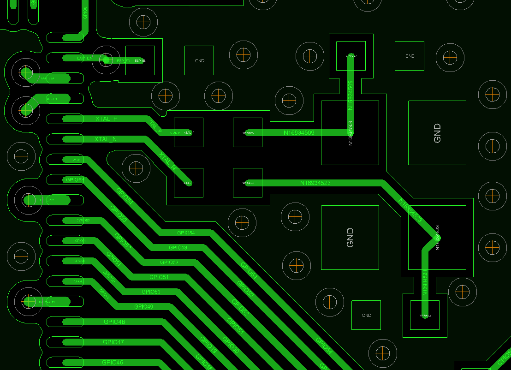
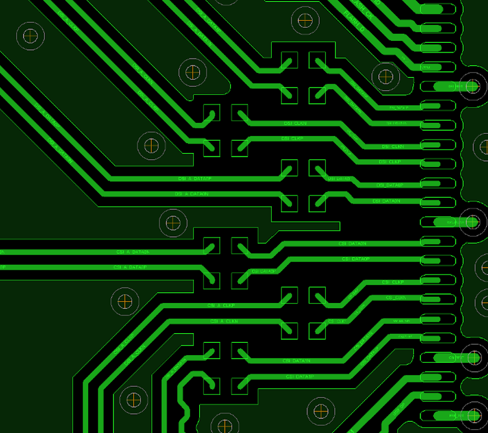

.. _pcb-layout-design:

PCB 版图布局
============
:link_to_translation:`en:[English]`

本章节将以 ESP32-P4 开发板的 PCB 布局为例，介绍 ESP32-P4 系列芯片的 PCB 布局设计要点。

基于芯片的版图设计通用要点
------------------------------------

考虑到高速信号线的通信质量和对射频模块的干扰问题，请至少采用四层板设计，即：

- 第一层（顶层），主要用于走信号线和摆件。
- 第二层（地层），不走信号线，保证一个完整的地平面。
- 第三层（电源线层），将电源走在该层；条件允许的话，将高速信号线走在该层并且保证参考平面完整。
- 第四层（底层），可走信号线。

.. _general-guidelines:

电源走线通用要点
^^^^^^^^^^^^^^^^^^^

- 电源走线请尽量走在内层（非地层），通过过孔连接至芯片管脚处。电源走线周围注意包地良好。
- 3.3 V 总电源的走线的线宽建议至少 25 mil。
- VDD_LP、VDD_IO_0、VDD_IO_4、VDD_IO_5 与 VDD_IO_6 各个管脚的电源走线建议至少 10 mil，这系列电源入口处请放置一个 10 μF 电容，然后在每个电源管脚上放置一个 0.1 μF 电容。
- VDD_HP_0、VDD_HP_2 与 VDD_HP_3 的总电源走线的线宽建议至少 20 mil，这系列电源入口处请放置一个 10 μF 电容，然后在每个电源管脚上放置一个 0.1 μF 电容。
- VDD_LDO 和 VDD_DCDCC 因为电源电流较大，请在两个电源管脚附近放置一个 10 μF 电容，走线建议至少 20 mil。
- 每个系列的电源走线建议通过星型走线的方式分给各个电源管脚。
- VDD_HP 电源的 DCDC 请靠近芯片放置，保证输入、输出和反馈回路尽可能小。因为 VDD_HP 电源默认由 ESP32-P4 内部完全控制，因此外部 DCDC 请靠近芯片放置，保证输入、输出和反馈回路尽可能小。

.. _crystal-layout:

晶振
-------

下图为 ESP32-P4 系列芯片晶振参考设计图。

    ESP32-P4 系列芯片晶振设计

晶振设计应遵循以下规范：

- 需要保证晶振和芯片有一个完整的地平面。
- 晶振需离芯片时钟管脚稍远一些放置，防止晶振干扰到芯片。间距应至少为 4.5 mm。同时晶振走线须用地包起来周围密集地孔屏蔽隔离。
- 晶振的时钟走线不可打孔走线。
- 晶振上的串联元器件请靠近芯片放置。
- 晶振外接的对地调节电容请靠近晶振左右两侧摆放，不可直接连接在串联元器件上。电容尽量置于时钟走线连接末端，保证电容的地焊盘靠近晶振的地焊盘放置。
- 晶振下方都不能走高频数字信号，最好是晶振下方不走任何信号线。晶振时钟走线两侧的电源线上的过孔应尽可能地远离时钟走线放置，并使时钟走线两侧尽可能包地。
- 晶振为敏感器件，晶振周围不能放置磁感应器件，比如大电感等，保证晶振周围有干净的大面积地平面。

USB
-------

USB 版图设计应遵循以下规范：

- USB 线上预留的电阻和电容请靠近 {IDF_TARGET_NAME} 放置。
- USB 走线请按照差分走线，差分线阻抗控制标准是 90 Ω，误差不能大于 ±10%，保持平行等长。
- USB 差分走线尽可能减少打孔换层，从而可以更好的做到阻抗的控制，避免信号的反射。如果必须打孔，请在每次打孔换层的地方加一对地孔回流。
- USB 走线下方一定要有参考层（推荐用地层），且一定要保证参考层的连续性。
- USB 走线两侧请注意包地处理。

SDIO
--------

SDIO 版图设计应遵循以下规范：

- SDIO 走线因为速率较高，需要尽量控制其寄生电容。
- SDIO_CMD、SDIO_DATA0 ~ SDIO_DATA3 走线长度以 SDIO_CLK 走线长度为基准 ±50 mil，需要时绕蛇形线。
- SDIO 走线请保证 50 Ω 单端阻抗控制，误差不能大于 ±10%。
- 从芯片 SDIO 管脚到对端 SDIO 接口的总长度越短越好，最好在 2000 mil 以内。
- SDIO 走线要保证不跨平面。SDIO 走线下方一定要有要有参考层（推荐用地层），且一定要保证参考层的连续性。
- SDIO_CLK 走线两侧请注意包地处理。
- 对于层数较多的 PCB 设计，建议 SDIO 走线在芯片引出后立即通过过孔引入内层，以降低高速信号线的干扰。同时，请在打孔换层的地方加一对地孔回流。

触摸传感器
--------------

.. include:: esp32p4/esp32p4-touch-sensor-design.inc

电极图形
^^^^^^^^^^^^^^

.. include:: esp32p4/esp32p4-touch-sensor-electrode-pattern.inc

PCB 布局
^^^^^^^^^^^^^

.. include:: esp32p4/esp32p4-touch-sensor-pcb-layout.inc

防水和接近传感器布局
^^^^^^^^^^^^^^^^^^^^^^^

.. include:: esp32p4/esp32p4-touch-sensor-waterproof-design.inc

.. note::

    更多关于触摸传感器的硬件设计可查看 `触摸传感器应用方案简介 <https://github.com/espressif/esp-iot-solution/blob/release/v1.0/documents/touch_pad_solution/touch_sensor_design_cn.md>`_。

MIPI
----

    ESP32-P4 系列芯片 MIPI 版图设计

MIPI 版图设计应遵循以下规范：

- MIPI 走线因为速率较高，需要尽量控制其寄生电容。
- MIPI 的差分线阻抗控制标准是 100 Ω，误差不能大于 ±10%。
- MIPI 线始终保持等长和等距；MIPI 线对之间的长度误差要控制在 10 mil 以内，线对与线对之间的长度误差控制在 30 mil 以内，需要时绕蛇形线。
- MIPI 线对之间建议包地隔离，如果没有办法包地，MIPI 线对之间要保持至少 2W 以上的间距，其中 W 为 MIPI 线宽。MIPI CLK 走线请包地处理。
- MIPI 信号线应远离其它高速、高频信号（并行数据线、时钟线等），至少保持 3W 以上的距离且绝不能平行走线，对开关电源这一类的干扰源更应远离。
- MIPI 信号线下方一定要有参考层（推荐用地层），且一定要保证参考层的连续性。
- 对于层数较多的 PCB 设计，建议 MIPI 走线在芯片引出后立即通过过孔引入内层，以降低高速信号线的干扰。同时，请在打孔换层的地方加一对地孔回流。
