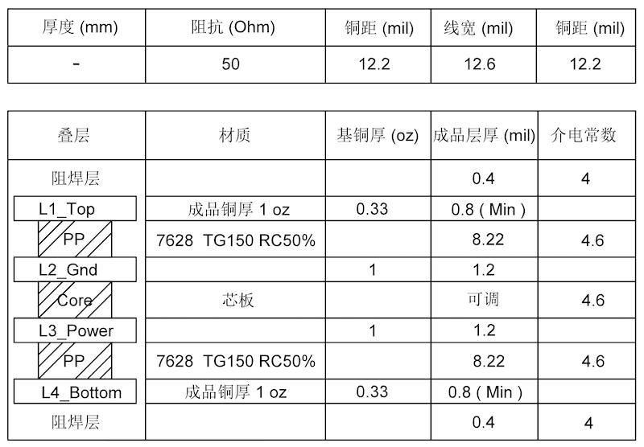

.. _pcb-layout-design:

PCB 版图布局
============
:link_to_translation:`en:[English]`

本章节将以 {IDF_TARGET_NAME} 模组的 PCB 布局为例（见图 :ref:`fig-pcb-layout-example`），介绍 {IDF_TARGET_NAME} 系列芯片的 PCB 布局设计要点。

.. figure:: ../_static/{IDF_TARGET_PATH_NAME}/{IDF_TARGET_PATH_NAME}-pcb-layout-example.png
   :name: fig-pcb-layout-example
   :align: center
   :width: 50%
   :alt: {IDF_TARGET_NAME} 模组版图参考设计

   {IDF_TARGET_NAME} 模组版图参考设计

基于芯片的版图设计通用要点
--------------------------------

建议采用四层板设计，即：

- 第一层（顶层），主要用于走信号线和摆件。
- 第二层（地层），不走信号线，保证一个完整的地平面。
- 第三层（电源线层），铺地平面，使射频及晶振部分可以得到更好的屏蔽。在保证射频及晶振部分下方完整地平面的情况下，将电源走在该层，可适度走信号线。
- 第四层（底层），不建议摆件，可适度走信号线。

.. only:: not esp32c5

    如采用两层板设计：

    - 第一层（顶层），主要用于摆件和走线。
    - 第二层（底层），不要摆件，走线也越少越好，保证射频、晶振和芯片有一个完整的地平面。

.. _pcb-layout-design-power-supply:

电源
-------

{IDF_TARGET_POWER_TRACE_WIDTH:default="25", esp32c3="20", esp32c2="20", esp32h2="20", esp32c5="35"}

{IDF_TARGET_ANALOG_POWER_TRACE:default="VDD3P3", esp32c6="VDDA3P3", esp32c2="VDDA3P3", esp32h2="pin1 和 pin2 处的 VDD3P3", esp32s2="pin3 和 pin4 处的 VDD3P3", esp32c5="管脚 1、3、40 和 41 处的 VDDA6、VDDA7、VDDA1 和 VDDA2", esp32s3="pin2 和 pin3 处的 VDD3P3"}

{IDF_TARGET_ANALOG_POWER_TRACE_WIDTH:default="20", esp32c3="15", esp32c2="15", esp32h2="15"}

{IDF_TARGET_ANALOG_FILTER_CIRCUIT:default="CLC", esp32c3="LC", esp32c2="LC"}

{IDF_TARGET_RF_POWER_TRACE:default="管脚 2、3", esp32c5="管脚 1、3、40 和 41 "}

.. only:: not esp32h2

    .. include:: shared/pcb-power-layout-four-layer.inc

.. only:: esp32h2

    .. include:: {IDF_TARGET_PATH_NAME}/{IDF_TARGET_PATH_NAME}-pcb-power-layout-four-layer.inc

.. only:: esp32 or esp32c3 or esp32s2 or esp32s3 or esp32c6 or esp32c61

    .. include:: shared/pcb-power-layout-two-layer.inc

.. _crystal-layout:

晶振
-------

{IDF_TARGET_CRYSTAL_GAP:default="待定", esp32="2.7", esp32s2="2.0", esp32s3="2.0", esp32c3="2.0", esp32c6="2.4", esp32h2="1.8", esp32c2="2.0", esp32s2="2.0", esp32c5="2.4", esp32c61="2.4"}

.. only:: esp32

    图 :ref:`fig-crystal-ref-design` 为 {IDF_TARGET_NAME} 的晶振设计参考图。

    .. figure:: ../_static/{IDF_TARGET_PATH_NAME}/{IDF_TARGET_PATH_NAME}-crystal-ref-design.png
        :name: fig-crystal-ref-design
        :align: center
        :width: 70%
        :alt: {IDF_TARGET_NAME} 系列芯片晶振设计

        {IDF_TARGET_NAME} 系列芯片晶振设计

.. only:: not esp32c2 and not esp32s2 and not esp32c3 and not esp32

    图 :ref:`fig-crystal-not-to-gnd` 为晶振通过通孔连接到地平面，但是顶层通过设置 keep-out 和地隔离开的参考设计图。

    .. figure:: ../_static/{IDF_TARGET_PATH_NAME}/{IDF_TARGET_PATH_NAME}-pcb-crystal-not-to-gnd.png
        :name: fig-crystal-not-to-gnd
        :align: center
        :width: 70%
        :alt: {IDF_TARGET_NAME} 系列芯片晶振设计（顶层有 keep-out）

        {IDF_TARGET_NAME} 系列芯片晶振设计（顶层有 keep-out）

.. only:: esp32s3 or esp32h2 or esp32c2 or esp32s2 or esp32c3

    图 :ref:`fig-crystal-to-gnd` 为晶振通过通孔连接到地平面，但是顶层没有设置 keep-out 和地隔离开的参考设计图。

    .. figure:: ../_static/{IDF_TARGET_PATH_NAME}/{IDF_TARGET_PATH_NAME}-pcb-crystal-to-gnd.png
        :name: fig-crystal-to-gnd
        :align: center
        :width: 60%
        :alt: {IDF_TARGET_NAME} 系列芯片晶振设计（顶层没有 keep-out）

        {IDF_TARGET_NAME} 系列芯片晶振设计（顶层没有 keep-out）

.. only:: esp32s3 or esp32h2 or esp32c5 or esp32c61 or esp32c6

    如果顶层的地很充分，建议顶层设置 keep-out 和地隔离开，既可以减小寄生电容，也可以抑制温度传导，以防影响频偏。如果不充分，建议不设置 keep-out，和地充分接触。

晶振设计应遵循以下规范：

- 需要保证射频、晶振和芯片有一个完整的地平面。
- 晶振需离芯片时钟管脚稍远一些放置，防止晶振干扰到芯片。间距应至少为 {IDF_TARGET_CRYSTAL_GAP} mm。同时晶振走线须用地包起来，周围用密集的地孔屏蔽隔离。
- 晶振的时钟走线不可打孔走线。
- 晶振上的串联元器件请靠近芯片放置。
- 晶振外接的对地调节电容请靠近晶振左右两侧摆放，不可直接连接在串联元器件上。电容尽量置于时钟走线连接末端，保证电容的地焊盘靠近晶振的地焊盘放置。
- 晶振下方都不能走高频数字信号，最好是晶振下方不走任何信号线。晶振时钟走线两侧的电源线上的过孔应尽可能地远离时钟走线放置，并使时钟走线两侧尽可能包地。
- 晶振为敏感器件，晶振周围不能放置磁感应器件，比如大电感等，保证晶振周围有干净的大面积地平面。

.. _rf-layout:

射频
-----

{IDF_TARGET_STUB_LENGTH:default="15", esp32c5="10"}

{IDF_TARGET_RF_MATCHING_CIRCUIT:default="CLC", esp32c61="CLCCL", esp32c5="5G 射频接口的 CLC", esp32c6="CLCCL"}

.. only:: esp32

    四层板设计
    ^^^^^^^^^^^^^

图 :ref:`fig-rf-layout` 中粉色高亮走线即为射频走线。

.. figure:: ../_static/{IDF_TARGET_PATH_NAME}/{IDF_TARGET_PATH_NAME}-pcb-rf-layout.png
    :name: fig-rf-layout
    :align: center
    :width: 50%
    :alt: {IDF_TARGET_NAME} 系列芯片四层板射频部分版图设计

    {IDF_TARGET_NAME} 系列芯片四层板射频部分版图设计

射频版图设计应遵循以下规范：

.. list::

    - 射频走线需做 50 Ω 阻抗控制，参考平面为芯片邻层。射频走线在做 50 Ω 阻抗控制时，可参考下图所示的 PCB 叠层结构设计。

    {IDF_TARGET_NAME} 系列芯片 PCB 叠层结构设计

.. list::

    :esp32c2 or esp32c6 or esp32c61: - 射频走线上需预留一个 {IDF_TARGET_RF_MATCHING_CIRCUIT} 匹配电路。请使用 0201 器件，把匹配器件靠近管脚放置，并呈 Z 字型摆放。也就是说两个电容勿朝同一方向，以减少互相干扰。
    :esp32c5: - 调节芯片需要至少一个 CLC 匹配电路。请使用 0201 器件，把匹配器件靠近管脚放置，并呈 Z 字型摆放。也就是说两个电容勿朝同一方向，以减少互相干扰。
    :not esp32c2 and not esp32c5 and not esp32c6 and not esp32c61: - 调节芯片需要一个 CLC 匹配电路。请使用 0201 器件，把匹配器件靠近管脚放置，并呈 Z 字型摆放。也就是说两个电容勿朝同一方向，以减少互相干扰。
    :not esp32s2: - {IDF_TARGET_RF_MATCHING_CIRCUIT} 匹配电路中靠近芯片侧的对地电容上请添加一段枝节，以有效抑制二次谐波。枝节的长度建议为 {IDF_TARGET_STUB_LENGTH} mil，线宽根据 PCB 叠层结构进行确定，确保枝节的特征阻抗为 100 Ω ± 10%。此外，枝节地孔与第三层相连，第一、二层做 keep-out 隔离处理。下图  :ref:`fig-stub-layout` 中的高亮走线即为枝节。当 {IDF_TARGET_RF_MATCHING_CIRCUIT} 匹配电路元器件封装为 0402 或者更大时，则无需做枝节处理。
    :esp32s2: - CLC 匹配电路中靠近芯片侧的对地电容上请添加一段枝节，以有效抑制二次谐波。枝节的长度建议为 {IDF_TARGET_STUB_LENGTH} mil，线宽根据 PCB 叠层结构进行确定，确保枝节的特征阻抗为 100 Ω ± 10%。此外，枝节地孔与第三层相连，第一、二层做 keep-out 隔离处理。当 CLC 匹配电路元器件封装为 0402 或者更大时，则无需做枝节处理。
    :esp32s3 or esp32c5 or esp32 or esp32c61 or esp32c6: - IPEX 天线连接器下方建议全部层净空，详见图 :ref:`fig-pcb-ipex-layout`。
    - PCB 天线请注意需要经过仿真和实际开发板测试。建议额外增加一组 CLC 匹配电路用于调节天线，该电路需尽可能地靠近天线端。

.. only:: not esp32s2

    .. figure:: ../_static/{IDF_TARGET_PATH_NAME}/{IDF_TARGET_PATH_NAME}-pcb-stub-layout.png
        :name: fig-stub-layout
        :align: center
        :width: 50%
        :alt: {IDF_TARGET_NAME} 系列芯片四层板射频枝节设计

        {IDF_TARGET_NAME} 系列芯片四层板射频枝节设计

.. only:: esp32s3 or esp32c5 or esp32 or esp32c61 or esp32c6

    .. figure:: ../_static/{IDF_TARGET_PATH_NAME}/{IDF_TARGET_PATH_NAME}-pcb-ipex-layout.png
        :name: fig-pcb-ipex-layout
        :align: center
        :width: 50%
        :alt: {IDF_TARGET_NAME} 系列芯片 IPEX 版图设计

        {IDF_TARGET_NAME} 系列芯片 IPEX 版图设计

- 射频走线线宽请注意保持一致，不可有分支走线。射频走线长度须尽量短，并注意周围密集地孔屏蔽。
- 射频走线在表层，走线不可有过孔，即不能跨层走线，且尽量使用 135° 角走线或是圆弧走线。
- 射频走线须保证相邻层完整地平面，射频走线下方尽可能不要有任何走线。
- 射频走线附近不能有高频信号线。射频上的天线必须远离所有传输高频信号的器件，比如晶振、DDR SDRAM、高频时钟等。另外，USB 端口、USB 转串口信号的芯片、UART 信号线（包括走线、过孔、测试点、插针引脚等）都必须尽可能地远离天线。且 UART 信号线做包地处理，周围加地孔屏蔽。

.. only:: esp32

    两层板设计
    ^^^^^^^^^^^^

    .. include:: {IDF_TARGET_PATH_NAME}/{IDF_TARGET_PATH_NAME}-rf-layout-two-layer-pcb-design.inc

.. only:: esp32 or esp32s3 or esp32c3 or esp32c6 or esp32s2 or esp32c5 or esp32c61

    {IDF_TARGET_FLASH_PSRAM:default="Flash", esp32="Flash 及 PSRAM", esp32s3="Flash 及 PSRAM", esp32s2="Flash 及 PSRAM", esp32c5="Flash 及 PSRAM", esp32c61="Flash 及 PSRAM"}

    {IDF_TARGET_FLASH_PSRAM_CASE:default="flash", esp32="flash 及 PSRAM", esp32s3="flash 及 PSRAM", esp32s2="flash 及 PSRAM"}

    {IDF_TARGET_VDD_POWER:default="VDD_SPI", esp32="VDD_SDIO"}

    {IDF_TARGET_FLASH_PSRAM}
    ---------------------------

    {IDF_TARGET_FLASH_PSRAM} 的设计应遵循以下规范：

    .. list::

        - SPI 通信线上预留的 0 Ω 串联电阻请靠近 {IDF_TARGET_NAME} 侧放置。
        - SPI 走线请尽可能地走到内层（例如第三层），并且时钟及数据走线都单独进行包地处理。
        :esp32s3: - 八线 SPI 还需做等长处理。
        :esp32c5 or esp32 or esp32s3 or esp32c3 or esp32c6 or esp32s2 or esp32c61: - 如果 flash 和 PSRAM 距离 {IDF_TARGET_NAME} 较远，建议在 {IDF_TARGET_VDD_POWER} 电源、flash 和 PSRAM 电源处都放置合适的去耦电容。

    .. only:: not esp32 and not esp32s2

        图 :ref:`fig-flash-layout` 所示为 quad flash 版图设计。

        .. figure:: ../_static/{IDF_TARGET_PATH_NAME}/{IDF_TARGET_PATH_NAME}-pcb-flash-layout.png
            :name: fig-flash-layout
            :align: center
            :width: 70%
            :alt: {IDF_TARGET_NAME} 系列芯片 Quad SPI Flash 版图设计

            {IDF_TARGET_NAME} 系列芯片 Quad SPI Flash 版图设计

    .. only:: esp32

        图 :ref:`fig-flash-layout` 所示为 flash (U3) 及 PSRAM (U4) 的版图设计。

        .. figure:: ../_static/{IDF_TARGET_PATH_NAME}/{IDF_TARGET_PATH_NAME}-pcb-flash-layout.png
            :name: fig-flash-layout
            :align: center
            :width: 70%
            :alt: {IDF_TARGET_NAME} 系列芯片 Flash 及 PSRAM 版图设计

            {IDF_TARGET_NAME} 系列芯片 Flash 及 PSRAM 版图设计

    .. only:: esp32s2

        图 :ref:`fig-flash-layout` 所示为 flash 及 PSRAM 的版图设计。

        .. figure:: ../_static/{IDF_TARGET_PATH_NAME}/{IDF_TARGET_PATH_NAME}-pcb-flash-layout.png
            :name: fig-flash-layout
            :align: center
            :width: 70%
            :alt: {IDF_TARGET_NAME} 系列芯片 Flash 及 PSRAM 版图设计

            {IDF_TARGET_NAME} 系列芯片 Flash 及 PSRAM 版图设计

    .. only:: esp32s3

        图 :ref:`fig-octal-flash-layout` 所示为 octal SPI flash 版图设计。

        .. figure:: ../_static/{IDF_TARGET_PATH_NAME}/{IDF_TARGET_PATH_NAME}-pcb-octal-flash-layout.png
            :name: fig-octal-flash-layout
            :align: center
            :width: 70%
            :alt: {IDF_TARGET_NAME} 系列芯片 Octal SPI Flash 版图设计

            {IDF_TARGET_NAME} 系列芯片 Octal SPI Flash 版图设计

.. only:: esp32

    外置阻容
    -----------

    外置阻容需靠近芯片管脚放置，并注意走线不可有过孔。注意需优先保证 10 nF 电容靠近管脚放置。

UART
---------

.. only:: not esp32s2

    图 :ref:`fig-uart-layout` 所示为 UART 版图设计。

    .. figure:: ../_static/{IDF_TARGET_PATH_NAME}/{IDF_TARGET_PATH_NAME}-pcb-uart-layout.png
        :name: fig-uart-layout
        :align: center
        :width: 60%
        :alt: {IDF_TARGET_NAME} UART Layout

        {IDF_TARGET_NAME} 系列芯片 UART 版图设计

UART 版图设计应遵循以下规范：

- U0TXD 线上的串联电阻请靠近芯片侧并远离晶振放置。
- U0TXD、U0RXD 在顶层的走线需尽量短。
- UART 走线两侧请注意包地处理，周围加地孔屏蔽。

.. _pcb-layout-design-on-a-base-board:

基于模组的版图设计通用要点（模组在底板上的位置摆放）
-------------------------------------------------------------

{IDF_TARGET_ANTENNA_POINT:default="馈点", esp32c5="接地点"}

{IDF_TARGET_ANTENNA_POINT_POSITION:default="右侧", esp32h2="左侧", esp32c2="左侧"}

如使用模组进行板上 (on-board) 设计，需注意模组在底板的布局，应尽可能地减小底板对模组 PCB 天线性能的影响。

建议将模组天线区域伸出板边，{IDF_TARGET_ANTENNA_POINT} 靠近底板板边放置。在下面模组摆放位置图中，✓ 代表强烈推荐的摆放位置，其他位置不推荐。

.. only:: not esp32c2

    .. figure:: ../_static/{IDF_TARGET_PATH_NAME}/{IDF_TARGET_PATH_NAME}-module-place-on-base-board-right.png
        :name: fig-module-place-on-base-board-right
        :align: center
        :width: 85%
        :alt: {IDF_TARGET_NAME} 系列模组 (天线{IDF_TARGET_ANTENNA_POINT}在右侧) 在底板上的位置示意图

        {IDF_TARGET_NAME} 系列模组 (天线{IDF_TARGET_ANTENNA_POINT}在右侧) 在底板上的位置示意图

.. only:: not esp32s2 and not esp32c5

    .. figure:: ../_static/{IDF_TARGET_PATH_NAME}/{IDF_TARGET_PATH_NAME}-module-place-on-base-board-left.png
        :name: fig-module-place-on-base-board-left
        :align: center
        :width: 85%
        :alt: {IDF_TARGET_NAME} 系列模组 (天线{IDF_TARGET_ANTENNA_POINT}在左侧) 在底板上的位置示意图

        {IDF_TARGET_NAME} 系列模组 (天线{IDF_TARGET_ANTENNA_POINT}在左侧) 在底板上的位置示意图

如果天线无法伸出板边，请保证给 PCB 天线一个足够大的净空区域（严禁铺铜、走线、摆放元件），该净空区域建议至少 15 mm（所有方向上都是）。PCB 天线下方区域的底板请切割掉，以尽可能地减少底板板材对 PCB 天线的影响。{IDF_TARGET_ANTENNA_POINT} 尽量靠近板边放置。图 :ref:`fig-module-clearance` 以 {IDF_TARGET_ANTENNA_POINT} 在 {IDF_TARGET_ANTENNA_POINT_POSITION} 的模组为例，画出了建议的净空区。

.. figure:: ../_static/{IDF_TARGET_PATH_NAME}/{IDF_TARGET_PATH_NAME}-module-clearance.png
    :name: fig-module-clearance
    :align: center
    :width: 60%
    :alt: {IDF_TARGET_NAME} 天线区域净空示意图

    {IDF_TARGET_NAME} 天线区域净空示意图

涉及整机设计时，请注意考虑外壳对天线的影响，并进行 RF 验证。请注意最终仍需要对整机产品进行吞吐量和通讯距离等测试来确保产品射频性能。

.. only:: esp32s3 or esp32c3 or esp32c6 or esp32h2 or esp32s2 or esp32c5 or esp32c61

    .. _usb-layout:

    USB
    -------

    USB 版图设计应遵循以下规范：

    - USB 线上预留的电阻和电容请靠近芯片侧放置。
    - USB 走线请按照差分走线，差分线阻抗控制标准是 90 Ω，误差不能大于 ±10%，保持平行等长。
    - USB 差分走线尽可能减少打孔换层，从而可以更好的做到阻抗的控制，避免信号的反射。如果必须打孔，请在每次打孔换层的地方加一对地孔回流。
    - USB 走线下方一定要有参考层（推荐用地层），且一定要保证参考层的连续性。
    - USB 走线两侧请注意包地处理。

.. only:: esp32 or esp32s3 or esp32c6 or esp32c5 or esp32c61

    .. _sdio-layout:

    SDIO
    --------

    SDIO 版图设计应遵循以下规范：

    .. list::

        - SDIO 走线因为速率较高，需要尽量控制其寄生电容。
        - SDIO_CMD、SDIO_DATA0 ~ SDIO_DATA3 走线长度以 SDIO_CLK 走线长度为基准 ± 50 mil，需要时绕蛇形线。
        - SDIO 走线请保证 50 Ω 单端阻抗控制，误差不能大于 ±10%。
        - 从芯片 SDIO 管脚到对端 SDIO 接口的总长度越短越好，最好在 2000 mil 以内。
        - SDIO 走线要保证不跨平面。SDIO 走线下方一定要有要有参考层（推荐用地层），且一定要保证参考层的连续性。
        - SDIO_CLK 走线两侧请注意包地处理。
        :esp32c61: - 对于层数较多的 PCB 设计，建议 SDIO 走线在芯片引出后立即通过过孔引入内层，以降低高速信号线的干扰。同时，请在打孔换层的地方加一对地孔回流。

    .. only:: esp32c5

        .. note::

            芯片版本 v1.0 支持该外设，v0.1 暂不可用。

.. only:: esp32 or esp32s3 or esp32s2

    触摸传感器
    --------------

    .. include:: {IDF_TARGET_PATH_NAME}/{IDF_TARGET_PATH_NAME}-touch-sensor-design.inc

    电极图形
    ^^^^^^^^^^^^^^

    .. include:: {IDF_TARGET_PATH_NAME}/{IDF_TARGET_PATH_NAME}-touch-sensor-electrode-pattern.inc

    PCB 布局
    ^^^^^^^^^^^^^

    .. include:: {IDF_TARGET_PATH_NAME}/{IDF_TARGET_PATH_NAME}-touch-sensor-pcb-layout.inc

    .. only:: esp32s3

        防水和接近传感器布局
        ^^^^^^^^^^^^^^^^^^^^^^^

        .. include:: {IDF_TARGET_PATH_NAME}/{IDF_TARGET_PATH_NAME}-touch-sensor-waterproof-design.inc

    .. note::

        更多关于触摸传感器的硬件设计可查看 `触摸传感器应用方案简介 <https://github.com/espressif/esp-iot-solution/blob/release/v1.0/documents/touch_pad_solution/touch_sensor_design_cn.md>`_。

版图设计常见问题
-------------------

.. include:: shared/faq.inc
