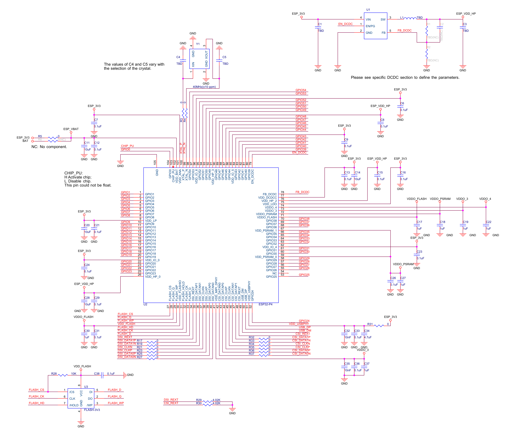
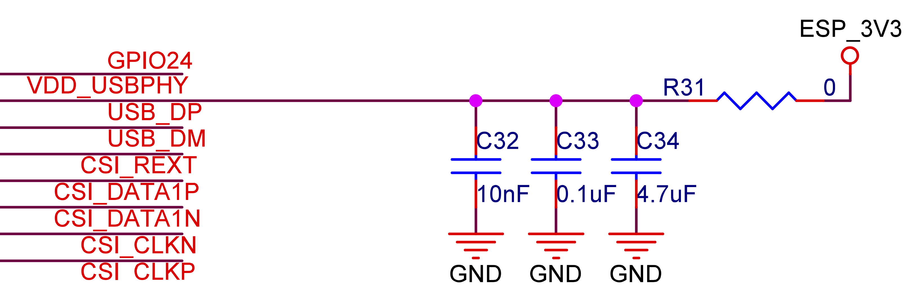

原理图设计
============
:link_to_translation:`en:[English]`

.. _schematic-checklist-overview:

概述
----

ESP32-P4 系列芯片的核心电路只需要 40 个左右的电阻电容电感和 1 个无源晶振，以及 1 个 SPI flash, 1 个 DCDC。为了能够更好地保证 ESP32-P4 系列芯片的工作性能，本章将详细介绍 ESP32-P4 系列芯片的原理图设计。

下图所示为 ESP32-P4 的核心电路参考设计，可以将它作为原理图设计的基础。

   ESP32-P4 系列芯片参考设计原理图

ESP32-P4 系列芯片的核心电路图的设计有以下重要组成部分：

.. list::

    - `电源`_
    - `上电时序与复位`_
    - `Flash 及 PSRAM`_
    - `时钟源`_
    - `UART`_
    - `Strapping 管脚`_
    - `GPIO`_
    - `ADC`_
    - `SDIO`_
    - `USB`_
    - `触摸传感器`_
    - `以太网 MAC`_
    - `MIPI`_

下文将分别对这些部分进行描述。

电源
--------

电源电路设计的通用要点有：

- 使用单电源供电时，建议供给 ESP32-P4 的电源电压为 3.3 V。
- ESP32-P4 的基本供电电流至少为 430 mA（含 flash 和 PSRAM），各个外设的供电电流请参考 `HP/LP IO 电源`_， `MIPI PHY 电源`_ 和 `USB PHY 电源`_。请根据具体应用选择合适的电源芯片。
- 建议在各个总电源入口处添加 10 μF 电容。
- 电源管理如图 :ref:`fig-chip-power-scheme` 所示。

.. figure:: ../_static/esp32p4/esp32p4-chip-power-scheme.png
   :name: fig-chip-power-scheme
   :align: center
   :width: 95%
   :alt: ESP32-P4 系列芯片电源管理

   ESP32-P4 系列芯片电源管理

有关电源管脚的更多信息，请查看 `ESP32-P4 系列芯片技术规格书 <{IDF_TARGET_DATASHEET_CN_URL}#cd-pwr-supply>`__ > 章节 *电源*。

.. _hp-lp-power-supply:

HP/LP IO 电源
^^^^^^^^^^^^^^^^^

.. include:: esp32p4/esp32p4-gpio-power-supply.inc

.. _mipi-phy-power-supply:

MIPI PHY 电源
^^^^^^^^^^^^^^^^

ESP32-P4 的管脚 VDD_MIPI_DPHY 为 MIPI PHY 电源管脚，工作电压范围为 2.25 V ~ 2.75 V，最大电流功耗为 50 mA。推荐使用内部电压稳压器供电，建议在电路中靠近 VDD_MIPI_DPHY 管脚处添加 10 nF + 0.1 μF + 1 μF。

如果不需要 MIPI 功能，管脚 VDD_MIPI_DPHY 可以悬空。

.. attention::

    MIPI 信号电平由 MIPI 协议规定，具体可以查阅 MIPI 协议相关文档，和 MIPI DPHY 电平是两个概念。摄像头/显示屏规格书中提到的 1.8 V/3.3 V 指的是除 MIPI 信号 (Data Lane & CLK) 之外的信号电平，如 MCLK 和 I2C 等。MIPI 信号电平由 ESP32-P4 内部 MIPI DPHY 自行处理，无需额外配置。

USB PHY 电源
^^^^^^^^^^^^^^^^

ESP32-P4 的管脚 VDD_USBPHY 为 USB PHY 电源管脚，工作电压范围为 2.97 V ~ 3.63 V，最大电流功耗为 20 mA。建议在电路中靠近 VDD_USBPHY 电源管脚处添加 10 nF + 0.1 μF + 4.7 μF。

如果不需要高速 USB 2.0 OTG 功能，管脚 VDD_USBPHY 可以悬空。如果使用了该电源，并且对功耗有要求，因为该电源无法完全关闭，在低功耗模式下有额外的耗电，建议添加一个 MOSFET 电路完全关断和外部电源的连接。初始可以预留一个串联电阻在 VDD_USBPHY 上。

  VDD_USBPHY 电路参考设计

Flash 和 PSRAM IO 电源
^^^^^^^^^^^^^^^^^^^^^^^^^^^

ESP32-P4 的管脚 VDD_FLASHIO 为 FLASH IO 电源管脚，工作电压范围为 1.65 V ~ 1.95 V/3.0 V ~ 3.6 V。该电源由内部电压稳压器输出 VDDO_FLASH 提供，建议在电路中靠近 VDD_FLASHIO 电源管脚处添加 0.1 μF + 1 μF。

管脚 VDD_PSRAM_0 和 VDD_PSRAM_1 为 PSRAM IO 电源管脚，工作电压范围为 1.65 V ~ 1.95 V。该电源由内部电压稳压器输出 VDDO_PSRAM 提供，建议在电路中靠近 VDD_PSRAM_0 和VDD_PSRAM_1 电源管脚处添加 0.1 μF + 1 μF。

模拟电源
^^^^^^^^^^^

ESP32-P4 的管脚 VDD_ANA 为模拟电源管脚，工作电压范围为 3.0 V ~ 3.6 V。建议在电路中靠近 VDD_ANA 电源管脚处添加 0.1 μF。管脚 VDD_BAT 为模拟电源管脚，工作电压范围为 3.0 V ~ 3.6 V，建议在电路中靠近 VDD_ANA 电源管脚处添加 0.1 μF + 10 μF。

VDD_BAT 电源管脚不可悬空，可外接电池，请参考 `ESP32-P4 备用电池供电方案 <https://docs.espressif.com/projects/esp-iot-solution/zh_CN/latest/low_power_solution/esp32p4_vbat.html>`__。

数字电源
^^^^^^^^^^^^^

ESP32-P4 的管脚 VDD_HP_0、管脚 VDD_HP_2 和管脚 VDD_HP_3 为数字电源管脚，工作电压范围为 0.99 V ~ 1.3 V。该电源由外部 DCDC 输出 ESP_VDD_HP 提供，建议在总电源处添加 10 uF，在各个电源管脚处添加 0.1 μF。

.. _internal-voltage-regulators:

内部电压稳压器和外部 DCDC
^^^^^^^^^^^^^^^^^^^^^^^^^^^

.. include:: esp32p4/esp32p4-ldo-dcdc.inc

上电时序与复位
----------------

ESP32-P4 的 CHIP_PU 管脚为高电平时使能芯片，为低电平时复位芯片。

当 ESP32-P4 使用 3.3 V 系统电源供电时，电源轨需要一些时间才能稳定，之后才能拉高 CHIP_PU，激活芯片。因此，CHIP_PU 管脚上电要晚于系统电源 3.3 V 上电。

复位芯片时，复位电压 V\ :sub:`IL_nRST` 范围应为 (–0.3 ~ 0.25 × VDD_BAT) V。为防止外界干扰引起重启，CHIP_PU 管脚引线需尽量短一些。

图 :ref:`fig-chip-timing` 为 ESP32-P4 系列芯片的上电、复位时序图。

.. figure:: ../_static/shared-chip-timing__cn.png
    :name: fig-chip-timing
    :align: center
    :scale: 70%
    :alt: ESP32-P4 系列芯片上电和复位时序图

    ESP32-P4 系列芯片上电和复位时序图

上电和复位时序参数说明见表 :ref:`tab-chip-timing`。

.. list-table:: 上电和复位时序参数说明
    :name: tab-chip-timing
    :header-rows: 1
    :widths: 20 60 20
    :align: center

    * - 参数
      - 说明
      - 最小值 (µs)
    * - t\ :sub:`STBL`
      - CHIP_PU 管脚上电晚于电源管脚上电的延时时间
      - 50
    * - t\ :sub:`RST`
      - CHIP_PU 电平低于 V\ :sub:`IL_nRST` 从而复位芯片的时间
      - 1000

.. attention::

    - CHIP_PU 管脚不可浮空。
    - 为确保芯片上电和复位时序正常，一般采用的方式是在 CHIP_PU 管脚处增加 RC 延迟电路。RC 通常建议为 R = 10 kΩ，C = 0.1 μF，但具体数值仍需根据实际的电源特性配合芯片的上电、复位时序进行调整。
    - 如果应用中存在以下场景：

        - 电源缓慢上升或下降，例如电池充电；
        - 需要频繁上下电的操作；
        - 供电电源不稳定，例如光伏发电等。

      此时，仅仅通过 RC 电路不一定能满足时序要求，有概率会导致芯片无法进入正常的工作模式。此时，需要增加一些额外的电路设计，比如：

        - 增加复位芯片或者看门狗芯片，通常阈值为 3.0 V 左右；
        - 通过按键或主控实现复位等。

Flash 及 PSRAM
------------------

ESP32-P4 系列芯片需配合封装外 flash 一起使用，用于存储应用的固件和数据。ESP32-P4 支持以 SPI、Dual SPI、Quad SPI 等接口形式连接 flash，最大可支持 64 MB flash。

ESP32-P4 系列芯片内部封装了 OPI/HPI 1.8 V PSRAM，请注意 PSRAM 引脚并没有引出芯片。

下面的表格列出了 ESP32-P4 与封装外 flash 的管脚对应关系。请注意这些芯片管脚最多连接一个 flash。

.. include:: esp32p4/esp32p4-chip-flash-pin-mapping.inc

请注意默认使用 VDDO_FLASH 输出电源作为 flash 的电源，默认使用 VDDO_PSRAM 输出电源作为 PSRAM 的电源。

当 VDDO_FLASH 为 3.3 V 输出模式的时候，VDD_LDO 需要考虑到 R\ :sub:`VFB` 的影响。比如在接 3.3 V flash 的情况下需满足以下条件：

.. math::

    VDD\_LDO > VDD\_flash\_min + I\_flash\_max \times R_{VFB}

其中，VDD_flash_min 为 flash 的最低工作电压，I_flash_max 为 flash 的最大工作电流，R\ :sub:`VFB` 是 3.3 V 模式导通电阻。

.. attention::

    - 建议 SPI flash 通信线上预留 0 Ω 串联电阻，以便在需要时进行灵活调整，实现降低驱动电流、减小对射频的干扰、调节时序、提升抗干扰能力等功能。
    - 请在 FLASH_CS 管脚处添加上拉电阻。
    - 建议在 flash 电源处添加 0.1 μF 电容。

时钟源
----------

ESP32-P4 外部可以有两个时钟源：

- `外置主晶振时钟源（必选）`_
- `RTC 时钟源（可选）`_

外置主晶振时钟源（必选）
^^^^^^^^^^^^^^^^^^^^^^^^^

目前 ESP32-P4 系列芯片固件仅支持 40 MHz 晶振。

ESP32-P4 的无源晶振部分电路如图 :ref:`fig-external-crystal-schematic`。注意，选用的无源晶振自身精度需在 ±10 ppm。

.. figure:: ../_static/esp32p4/esp32p4-sche-external-crystal.png
   :name: fig-external-crystal-schematic
   :align: center
   :width: 80%
   :alt: ESP32-P4 系列芯片无源晶振电路图

   ESP32-P4 系列芯片无源晶振电路图

外部匹配电容 C4 和 C5 的初始值可参考以下公式来决定：

.. math::

   C_L =  \frac{C4 \times C5} {C4+C5} + C_{stray}

其中 C\ :sub:`L` （负载电容）的值可查看所选择晶振的规格书，C\ :sub:`stray` 的值为 PCB 的寄生电容。C4 和 C5 的最终值需要通过对系统测试后进行调节确定。

.. _schematic-rtc-clock-source:

RTC 时钟源（可选）
^^^^^^^^^^^^^^^^^^^^^^^^^^^^^^^^^^^^

ESP32-P4 支持外置 32.768 kHz 的无源晶振作为 RTC 时钟。使用外部 RTC 时钟源是为了使时间更准确，从而降低平均功耗，但对于功能没有任何影响。

外置 32.768 kHz 无源晶振的电路如图 :ref:`fig-32khz-crystal-schematic` 所示。

.. figure:: ../_static/esp32p4/esp32p4-sche-32khz-crystal.png
    :name: fig-32khz-crystal-schematic
    :align: center
    :width: 60%
    :alt: ESP32-P4 系列芯片外置 32.768 kHz 无源晶振电路图

    ESP32-P4 系列芯片外置 32.768 kHz 无源晶振电路图

请注意 32.768 kHz 晶振选择要求：

    - 等效内阻 (ESR) ≤ 70 kΩ。
    - 两端负载电容值根据晶振的规格要求进行配置。

并联电阻 R 用于偏置晶振电路，电阻值要求 5 MΩ < R ≤ 10 MΩ。该电阻一般无需上件。

如果不需要该 RTC 时钟源，则 32.768 kHz 晶振的管脚也可配置为 GPIO 使用。

.. _schematic-checklist-uart:

UART
---------

ESP32-P4 有 5 个 UART 接口，即 UART0 ~ UART4，5 个 UART 均支持 CTS 和 RTS 信号的硬件流控以及软件流控（XON 和 XOFF）。ESP32-P4 还有 1 个 LP UART，LP UART 支持 CTS 和 RTS 信号的硬件流控以及软件流控（XON 和 XOFF）。

UART0_TXD 和 UART0_RXD 默认为 GPIO37 和 GPIO38，其他 UART0 信号可以通过软件配置到任意空闲 GPIO 管脚上。LP UART TXD 和 LP UART RXD 默认为 LP GPIO14 和 LP GPIO15，其他 LP UART 信号可以通过软件配置到任意空闲 LP GPIO 管脚上。

UART0 通常作为下载和 log 打印的串口，关于如何使用 UART0 进行下载，请参考章节 :ref:`download-guidelines`。

推荐使用 UART1 ~ UART4 作为通信的串口。

.. _schematic-checklist-spi:

SPI
---

在使用 SPI 功能时，为了提高 EMC 性能，请在 SPI_CLK 线上添加串联电阻（或磁珠）以及对地电容。如果空间允许，建议在其他 SPI 线上也添加串联电阻和对地电容。另外，请确保 RC/LC 器件靠近芯片或模组的管脚放置。

.. _schematic-checklist-strapping-pins:

Strapping 管脚
-----------------

芯片每次上电或复位时，都需要一些初始配置参数，如加载芯片的启动模式等。这些参数通过 strapping 管脚控制。复位放开后，strapping 管脚和普通 IO 管脚功能相同。

GPIO34、GPIO35、GPIO36、GPIO37、GPIO38 为 strapping 管脚。

所有的 strapping 管脚信息，可参考 `ESP32-P4 系列芯片技术规格书 <{IDF_TARGET_DATASHEET_CN_URL}>`__ > 章节 *启动配置项*。下面主要介绍和启动模式有关的 strapping 管脚信息。

芯片复位释放后，GPIO35、 GPIO36、 GPIO37 和 GPIO38 共同决定启动模式，详见表 :ref:`tab-chip-boot-mode-control`。

.. include:: esp32p4/esp32p4-chip-boot-mode-control.inc

Strapping 管脚的时序参数包括 *建立时间* 和 *保持时间*。更多信息，详见图 :ref:`fig-shared-strap-pin-timing` 和表 :ref:`tab-strap-pin-timing`。

.. figure:: ../_static/shared-strap-pin-timing.png
   :name: fig-shared-strap-pin-timing
   :align: center
   :width: 90%
   :alt: Strapping 管脚的时序参数图

   Strapping 管脚的时序参数图

.. list-table:: Strapping 管脚的时序参数说明
    :name: tab-strap-pin-timing
    :header-rows: 1
    :widths: 20 60 20
    :align: center

    * - 参数
      - 说明
      - 最小值 (ms)
    * - t\ :sub:`SU`
      - *建立时间*，即拉高 CHIP_PU 激活芯片前，电源轨达到稳定所需的时间
      - 0
    * - t\ :sub:`H`
      - *保持时间*，即 CHIP_PU 已拉高、strapping 管脚变为普通 IO 管脚开始工作前，可读取 strapping 管脚值的时间
      - 3

.. attention::

    - 建议在 GPIO35 管脚处预留上拉电阻。
    - 建议不要在 GPIO35 管脚处添加较大的电容，可能会导致进入下载模式。

GPIO
--------

ESP32-P4 系列芯片通过 IO MUX 表格或者 GPIO 交换矩阵来配置 GPIO。IO MUX 是默认的外设管脚配置（详见 `ESP32-P4 系列芯片技术规格书 <{IDF_TARGET_DATASHEET_CN_URL}#cd-append-consolid-pin-overview>`__ > 附录 *ESP32-P4 管脚总览*），GPIO 交换矩阵用于将可以配置的外设信号传输至 GPIO 管脚。更多关于 IO MUX 和 GPIO 交换矩阵的信息，请参考 `ESP32-P4 技术参考手册 <{IDF_TARGET_TRM_CN_URL}>`__ > 章节 *IO MUX 和 GPIO 交换矩阵*。

部分外设的 GPIO 管脚是固定的，部分是可以任意配置的，具体信息请参考 `ESP32-P4 系列芯片技术规格书 <{IDF_TARGET_DATASHEET_CN_URL}>`__ > 章节 *外设*。

使用 GPIO 时，请注意：

.. list::

    - Strapping 管脚的上电状态。
    - 请注意 GPIO 复位后的默认配置，详见表 :ref:`IO MUX Pin Functions`。建议对处于高阻态的管脚配置上拉或下拉，或在软件初始化时开启管脚自带的上下拉，以避免不必要的耗电。
    - Deep-sleep 模式下只能控制电源域为 VDD_LP 的 GPIO。
    - 仅用电池供电时只能控制电源域为 VDD_BAT 的 GPIO。

.. include:: esp32p4/esp32p4-table-io-mux.inc

ADC
------

.. include:: esp32p4/esp32p4-adc.inc

.. _esp32p4-sdio:

SDIO
--------

.. include:: esp32p4/esp32p4-sdio.inc

USB
-------

.. include:: esp32p4/esp32p4-usb.inc

触摸传感器
-------------

使用 TOUCH 功能时，建议靠近 {IDF_TARGET_NAME} 侧预留串联电阻，用于减小线上的耦合噪声和干扰，也可加强 ESD 保护。该阻值建议 470 Ω 到 2 kΩ，推荐 510 Ω。具体值还需根据产品实际测试效果而定。

ESP32-P4 系列芯片的触摸传感器同时还支持防潮功能和遇水保护功能。防潮设计可缓和小水珠带来的影响，ESP32-P4 触摸传感器引入 Shield Pad 这一特殊 PAD。用户可以任选一个触摸管脚作为 Shield Pad，Shield Pad 会和当前正在测量的触摸管脚进行并联，有效缓和水滴带来的影响。

.. _schematic-checklist-ethernet-mac:

以太网 MAC
---------------

.. include:: esp32p4/esp32p4-emac.inc

MIPI
----

ESP32-P4 带有一个 MIPI DSI 接口，用于连接 MIPI 接口的显示屏；它还带有一个 MIPI CSI 接口，用于连接 MIPI 接口的摄像头。请在 CSI_REXT 和 DSI_REXT 管脚处各添加 4.02 kΩ 下拉电阻。

建议在 MIPI 通信线上预留串联电阻（初始可使用 0 Ω），主要作用为降低驱动电流，调节时序，提升抗干扰能力等。

如果设计中有射频模块，请在 CSI 接口对接的设备端也添加串联电阻以降低对射频模块的干扰。

.. attention::

    - 如果不使用 MIPI 接口，电源和外置电阻管脚可以悬空。
    - 对于 MIPI 接口的设备，其控制信号请使用 GPIO。

.. figure:: ../_static/esp32p4/esp32p4-mipi.png
    :name: fig-mipi
    :align: center
    :width: 50%
    :alt: ESP32-P4 MIPI 信号电路图

    ESP32-P4 MIPI 信号电路图
